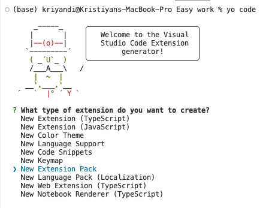
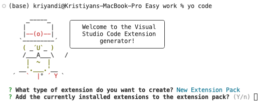
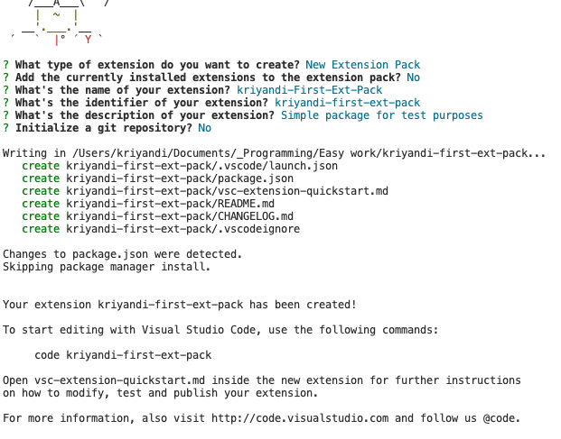
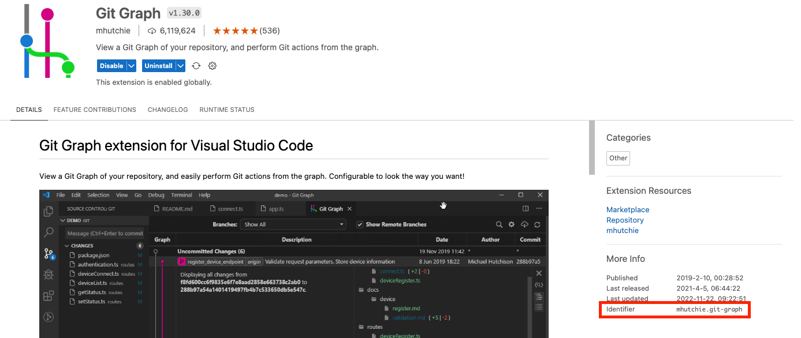
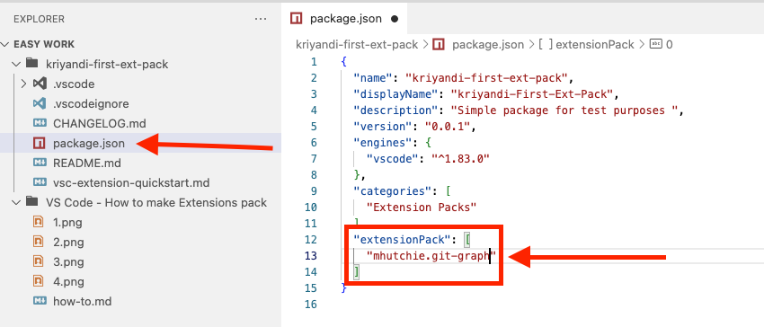

# How to Create Visual Studio Extensions Package

## Prerequisites:

- [Node.js](https://nodejs.org/en)

- [Yeoman and Yo Code](https://www.npmjs.com/package/generator-code)
  ```
  npm install -g yo generator-code
  ```

## Creating a Visual Studio Extension Package

First run the command:

```
yo code
```

Then select **"New Extension Pack"**



Next follow the instructions from Yo Code:



- Option 1 - **Y** (yes) will create a Visual Studio Extension Package with currently installed extensions

- Option 2 - **n** (no) will create empty Visual Studio Extension Package where you should add extensions

We choosed Option 2 and the result will be this:



## Add some Extensions

How to add extension:

1. Find wanted extension from **Extensions**
2. Click on it
3. Look for the extension identifier somewhere here:

   

4. Copy the identifier to the package.json file in **extensionPack** list property:

   

5. Add publisher property to the package.json file

6. Edit the README.md file since it will be show in the marketplace

# Package & Publish Extension

1. Install the Visual Studio Code Extension Manager

   ```
   npm install --global @vscode/vsce
   ```

2. Open Terminal and set directory to be the extension's folder

3. Execute the command and follow the instructions:
   ```
   vsce package
   ```
4. Your extension pack is ready!

5. To install the package go to the extension file package directory and execute the command:
   ```
   code --install-extension <file-name>.vsix
   ```

6)  OPTIONAL: Publish the extension to the market:

    https://code.visualstudio.com/api/get-started/your-first-extension

    https://code.visualstudio.com/api/working-with-extensions/publishing-extension#get-a-personal-access-token
